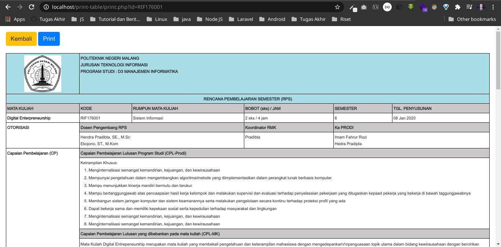

# Print Table Example

## Cara Menjalankan

1. Download file pada repository ini
2. Import database `kurikulum.sql`
3. Sesuaikan username, password database pada file `koneksi/koneksi.php`
4. Jalankan file dengan menulis url pada parameter `http://localhost/print-table/print.php?id=RIF176001`
   > `RIF176001` adalah kode mata kuliah, nantinya dia akan mengenerate secara otomatis sesuai dengan mata kuliah yang ditampilkan